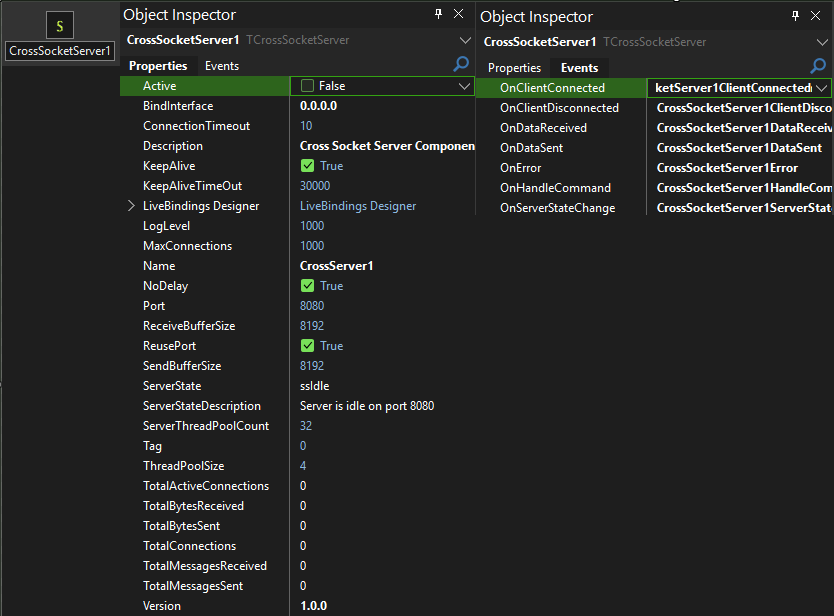
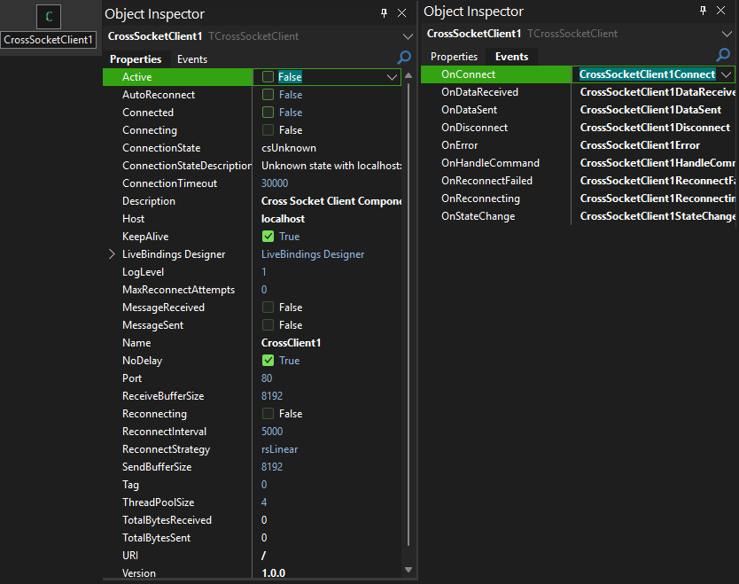

# 🌐 CrossSocket Wrapper Components v1.0.0
**High-Performance Cross-Platform Socket Components for Delphi**

> **📢 Important Note:** These components are **Work In Progress** at this time they WORK 100% they are Stable... some properties need to be removed as they are NOT functional im taking these sockets a different direction and need to remove some things. NO BIG DEAL ENJOY THEM!
> **📢 Important Note:** These components are **wrapper components** that make CrossSocket's base socket functionality drag-and-drop easy to use in Delphi. We wrap the original CrossSocket framework to provide familiar Delphi component architecture.
> 
> **🔮 Future Updates:** CrossSocket has additional HTTP libraries and other socket types. Keep an eye on this repo - we may expand to wrap those libraries as well!

<div align="center">


</div>

---

## 🎬 Component Preview

<div align="center">

### 🖥️ **CrossSocket Server Component**


### 💻 **CrossSocket Client Component**  


*See the components in action with real-time TCP connections, advanced state management, and enterprise-grade performance!*

</div>

---

## ✨ Why Choose CrossSocket Wrapper Components?

### 🎯 **Built for Modern Applications**
- **CrossSocket Framework**: Leverages the powerful CrossSocket async networking architecture
- **Cross-Platform Ready**: Windows, Linux, macOS support through CrossSocket (Works and Tested for Windows... we may update this component library in the future to support more OS'es)
- **Real-Time Bidirectional**: Instant push/pull communication between client and server

### 🔧 **Developer-Friendly**
- **Wrapper Components**: These are wrapper components that make CrossSocket's base socket functionality drag-and-drop easy
- **Familiar Delphi Components**: Traditional Delphi component architecture with events and properties
- **Thread-Safe Design**: Bulletproof multi-threaded operation (powered by CrossSocket)
- **Smart Auto-Reconnection**: Intelligent reconnection strategies with exponential backoff
- **Professional State Management**: Advanced connection state tracking and monitoring

### 🛡️ **Enterprise Features**
- **Connection Limit Management**: Advanced client connection limits and overflow handling
- **Comprehensive Statistics**: Real-time byte counters, message tracking, and performance metrics
- **Robust Error Handling**: Comprehensive error propagation and recovery
- **Professional Logging**: Configurable logging levels for debugging and monitoring

---

## 📦 Installation Requirements

### 🔨 **REQUIRED: CrossSocket Framework**

**You MUST download and install the original CrossSocket project first:**

1. **Download CrossSocket Framework**
   ```
   Get it from: https://github.com/winddriver/Delphi-Cross-Socket
   Clone or download the ZIP file to your local drive
   ```

2. **Add CrossSocket Library Paths**
   ```
   Tools → Options → Library Path → Add these CrossSocket folders:
   - [CrossSocket Path]\Source
   - [CrossSocket Path]\Net
   ```

3. **Build Our Wrapper Package**
   ```
   Open CrossSocketComponents.dproj → Build → Install
   ```

4. **Start Building!**
   ```
   Find components in Tool Palette under "Cross Socket"
   ```

---

## 🏗️ Components Overview

### 🖥️ **TCrossSocketServer** - TCP Server Wrapper Component

A wrapper around CrossSocket's base server functionality that provides familiar Delphi component interface for managing multiple simultaneous connections.

#### 📋 **Key Properties**

| Property | Type | Default | Description |
|----------|------|---------|-------------|
| `Active` | Boolean | False | ⚡ Start/stop the TCP server |
| `Port` | Integer | 8080 | 🔌 Server listening port |
| `BindInterface` | String | "0.0.0.0" | 🌐 Server bind interface |
| `MaxConnections` | Integer | 1000 | 👥 Maximum concurrent connections |
| `ServerThreadPoolCount` | Integer | 32 | 🧵 Async thread pool size |
| `KeepAliveTimeOut` | Integer | 30000 | ⏱️ Keep-alive timeout (ms) |
| `ConnectionTimeout` | Integer | 10 | 🔌 Connection timeout (seconds) |
| `ReceiveBufferSize` | Integer | 8192 | 📥 Receive buffer size (bytes) |
| `SendBufferSize` | Integer | 8192 | 📤 Send buffer size (bytes) |
| `NoDelay` | Boolean | True | ⚡ TCP No Delay option |

#### 📊 **Statistics Properties (Read-Only)**

| Property | Type | Description |
|----------|------|-------------|
| `ClientCount` | Integer | 👥 Current active connections |
| `TotalConnections` | Int64 | 📈 Total connections since start |
| `TotalActiveConnections` | Int64 | 🔴 Live connection count |
| `TotalBytesReceived` | Int64 | 📥 Total bytes received |
| `TotalBytesSent` | Int64 | 📤 Total bytes sent |
| `TotalMessagesReceived` | Int64 | 📨 Total messages received |
| `TotalMessagesSent` | Int64 | 📤 Total messages sent |
| `ServerState` | TCrossSocketServerState | 🔄 Current server state |

#### 🎪 **Events**

| Event | Description |
|-------|-------------|
| `OnClientConnected` | 🎉 Client connected to server |
| `OnClientDisconnected` | 👋 Client disconnected from server |
| `OnDataReceived` | 📨 Data received (for statistics/logging) |
| `OnDataSent` | 📤 Data sent (for statistics/logging) |
| `OnHandleCommand` | 📋 **Process incoming data here** |
| `OnError` | ❌ Error occurred |
| `OnServerStateChange` | 🔄 Server state changed |

---

### 💻 **TCrossSocketClient** - TCP Client Wrapper Component

A wrapper around CrossSocket's base client functionality that provides intelligent auto-reconnection and familiar Delphi component interface.

#### 📋 **Key Properties**

| Property | Type | Default | Description |
|----------|------|---------|-------------|
| `Active` | Boolean | False | ⚡ Connect/disconnect |
| `Host` | String | "localhost" | 🌐 Server hostname/IP |
| `Port` | Integer | 80 | 🔌 Server port |
| `URI` | String | "/" | 🌐 URI path (for compatibility) |
| `Connected` | Boolean | False | 🔗 Connection state |
| `ConnectionTimeout` | Integer | 30000 | ⏱️ Connection timeout (ms) |
| `AutoReconnect` | Boolean | False | 🔄 Enable auto-reconnection |
| `ReconnectStrategy` | TCrossSocketReconnectStrategy | rsLinear | 📈 Reconnection strategy |
| `ReconnectInterval` | Integer | 5000 | ⏰ Base reconnection interval (ms) |
| `MaxReconnectAttempts` | Integer | 0 | 🔢 Maximum reconnection attempts |

#### 🔄 **Reconnection Strategies**

| Strategy | Description |
|----------|-------------|
| `rsLinear` | ⏰ Fixed interval reconnection |
| `rsExponential` | 📈 Exponential backoff (smart) |

#### 📊 **Statistics Properties (Read-Only)**

| Property | Type | Description |
|----------|------|-------------|
| `ConnectionState` | TCrossSocketConnectionState | 🔄 Current connection state |
| `ConnectionStateDescription` | String | 📝 Human-readable state |
| `TotalBytesReceived` | Int64 | 📥 Total bytes received |
| `TotalBytesSent` | Int64 | 📤 Total bytes sent |
| `Reconnecting` | Boolean | 🔄 Currently reconnecting |

#### 🎪 **Events**

| Event | Description |
|-------|-------------|
| `OnConnect` | 🎉 Connected to server |
| `OnDisconnect` | 👋 Disconnected from server |
| `OnDataReceived` | 📨 Data received (for statistics/logging) |
| `OnDataSent` | 📤 Data sent (for statistics/logging) |
| `OnHandleCommand` | 📋 **Process incoming data here** |
| `OnError` | ❌ Error occurred |
| `OnStateChange` | 🔄 Connection state changed |
| `OnReconnecting` | 🔄 Attempting reconnection |
| `OnReconnectFailed` | ❌ Reconnection attempt failed |

---

## 🚀 Quick Start Guide

### 🎯 **Essential Methods**

**Server Operations:**
- `CrossSocketServer1.Active := True` - Start server
- `CrossSocketServer1.Active := False` - Stop server
- `CrossSocketServer1.SendCommandToClient(ClientID, Data)` - Send to specific client
- `CrossSocketServer1.BroadcastCommand(Data)` - Send to ALL clients

**Client Operations:**
- `CrossSocketClient1.Connect` - Connect to server
- `CrossSocketClient1.Disconnect` - Disconnect from server
- `CrossSocketClient1.SendCommand(Data)` - Send to server

**Information Methods:**
- `CrossSocketServer1.GetClientCount` - Get total connected clients
- `CrossSocketServer1.GetClientIP(ClientID)` - Get client IP address
- `CrossSocketServer1.GetServerStats` - Get comprehensive server statistics

---

## 📨 Event Handling - Where YOU Process Data

### 🎪 **Server Events**

```pascal
// Handle client connections
procedure TServerForm.CrossSocketServer1ClientConnected(Sender: TObject; 
  ClientID: Integer);
begin
  // Client connected - use ClientID to track them
end;

// THIS IS WHERE YOU PROCESS INCOMING DATA!
procedure TServerForm.CrossSocketServer1HandleCommand(Sender: TObject; 
  ClientID: Integer; const Command: TBytes);
var
  Message: string;
begin
  Message := StringOf(Command);
  // Process the message from client here!
  
  // Example: Echo back
  CrossSocketServer1.SendCommandToClient(ClientID, BytesOf('Echo: ' + Message));
end;
```

### 🎪 **Client Events**

```pascal
// Handle connection
procedure TClientForm.CrossSocketClient1Connect(Sender: TObject);
begin
  // Connected to server!
end;

// THIS IS WHERE YOU PROCESS INCOMING DATA!
procedure TClientForm.CrossSocketClient1HandleCommand(Sender: TObject; 
  const Command: TBytes);
var
  Message: string;
begin
  Message := StringOf(Command);
  // Process the message from server here!
end;
```

---

## 🎬 **Complete Demo Application**

A complete working demo application is included that shows:
- ✅ Server start/stop operations
- ✅ Client connect/disconnect with auto-reconnect
- ✅ Send to specific client vs broadcast to all
- ✅ Real-time connection monitoring
- ✅ Complete event handling examples
- ✅ Error handling and logging

**Just run the demo to see it all in action!**

---

## 🛠️ Connection States & Management

### 📦 **Server States**

| State | Description |
|-------|-------------|
| `ssIdle` | Server is stopped |
| `ssStarting` | Server is starting up |
| `ssListening` | Server is accepting connections |
| `ssStopping` | Server is shutting down |
| `ssError` | Server encountered an error |

### 📦 **Client Connection States**

| State | Description |
|-------|-------------|
| `csUnknown` | Unknown/Initial state |
| `csConnecting` | Currently connecting |
| `csHandshaking` | Performing handshake |
| `csConnected` | Successfully connected |
| `csDisconnecting` | Currently disconnecting |
| `csDisconnected` | Disconnected (clean) |
| `csClosed` | Connection closed (with error) |
| `csError` | Error state |

---


---

## 🏆 Performance & Compatibility

### ⚡ **Performance Specs**
- **Real-Time Communication**: Ultra-low latency data transfer
- **Memory Usage**: Efficient memory management with connection pooling
- **CPU Usage**: Multi-threaded async architecture for maximum performance

### 🔧 **Compatibility**
- **Delphi Versions**: XE2, XE3, XE4, XE5, XE6, XE7, XE8, 10 Seattle, 10.1 Berlin, 10.2 Tokyo, 10.3 Rio, 10.4 Sydney, 11 Alexandria, 12 Athens, 12.2
- **Platforms**: Windows, Linux, macOS (through CrossSocket)
- **Frameworks**: VCL, FMX, Console applications
- **Dependencies**: CrossSocket framework (required)

### 📋 **Requirements**
- ✅ CrossSocket framework properly installed
- ✅ Supported platform (Windows/Linux/macOS)
- ✅ Delphi XE2 or later

---

## 🎯 **Why v1.0.0 is Special**

### 🛡️ **BULLETPROOF TCP Features**
- **Professional State Management**: Comprehensive connection state tracking
- **Smart Reconnection**: Exponential backoff strategies for network interruptions
- **Memory Leak Prevention**: Advanced cleanup procedures prevent resource leaks
- **Thread-Safe Operations**: All operations properly synchronized for multi-threaded safety
- **Connection Limit Management**: Professional client connection overflow handling

### 🆕 **Version 1.0.0 Features**
- ✅ Complete TCP server/client implementation using CrossSocket
- ✅ Advanced auto-reconnection with linear and exponential backoff
- ✅ Bulletproof connection state management
- ✅ Professional error handling and event management
- ✅ Comprehensive statistics and monitoring
- ✅ Cross-platform compatibility through CrossSocket framework

---

## 📞 **Support & Community**

### 💬 **Get Help**
- **Issues**: Report bugs via GitHub Issues
- **Questions**: Community support available
- **Contributing**: Pull requests welcome!
- **Discord**: bitmasterxor

### 📜 **License**
**Open Source** - Free to distribute and use in commercial and personal projects!

### 🔗 **Dependencies**
- **CrossSocket**: https://github.com/winddriver/Delphi-Cross-Socket
- **Required**: Install CrossSocket framework before using these components

---

<div align="center">

**🌐 Ready to Build High-Performance TCP Applications?**

*Download • Install • Build Amazing Real-Time Apps!*

**Made By BitmasterXor And Friends With ❤️ for the Delphi Community**

</div>
